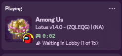

## Custom Discord RPC for [Project: Lotus](https://github.com/Lotus-AU/LotusContinued)
<u><a href="https://github.com/ThetaHalo/LotusDiscordRPC">Latest Release</a></u> | <u><a href="https://github.com/Lotus-AU/LotusContinued/releases/latest">Download Project: Lotus!</a></u>
---

### Preview.

### Installing
Download the latest release, then drop it into your `Among Us/Addons` folder, then open Among Us!

### Features:
- Shows the Following
  - Lobby Status (InGame, Lobby, etc.)
  - Current Code & Region
  - Current Map
  - How many Players
- If you need to disable the presence from showing lobby info, simply turn on **Streamer Mode.** in the General Settings, or disable your Discord Activity in `Activity Privacy -> Share your detected activies with others.`

##### Notice:
> This Mod/Addon is not affiliated with Among Us or Innersloth LLC, and the content contained therein is not endorsed or otherwise sponsored by Innersloth LLC. Portions of the materials contained herein are property of Innersloth LLC. © Innersloth LLC.